## Hi there 👋

<!--
**CUHKSZzxy/CUHKSZzxy** is a ✨ _special_ ✨ repository because its `README.md` (this file) appears on your GitHub profile.

Here are some ideas to get you started:

- 🔭 I’m currently working on ...
- 🌱 I’m currently learning ...
- 👯 I’m looking to collaborate on ...
- 🤔 I’m looking for help with ...
- 💬 Ask me about ...
- 📫 How to reach me: ...
- 😄 Pronouns: ...
- ⚡ Fun fact: ...
-->

<!--

-->

## Open-source Work

Focused on LLM/VLM serving systems.

Selected contributions:

| #PR | Status | Summary |
| --- | --- | --- |
| [LMDeploy GLM-5.2 optimizations](https://github.com/InternLM/lmdeploy/pulls?q=is%3Apr+author%3ACUHKSZzxy+GLM-5.2) | 🟣 | [#4896 bounded DSA prefill score memory, short DSA prefill fast path](https://github.com/InternLM/lmdeploy/pull/4896) [#4853 CUDA all-reduce, BF16 router GEMM, PDL](https://github.com/InternLM/lmdeploy/pull/4853) [#4827 DSA index scoring, Q/KV-A projection fusion, LM-head sharding, etc.](https://github.com/InternLM/lmdeploy/pull/4827) |
| [LMDeploy model support](https://github.com/InternLM/lmdeploy/pulls?q=is%3Apr+author%3ACUHKSZzxy) | 🟢/🟣 | [#4780 Intern-S2-Preview TS (397B)](https://github.com/InternLM/lmdeploy/pull/4780); [#4737 GLM-5.2 (753B)](https://github.com/InternLM/lmdeploy/pull/4737) [#4575 Intern-S2-Preview (35B-A3B)](https://github.com/InternLM/lmdeploy/pull/4575); [#4411 Qwen3-Omni (30B-A3B)](https://github.com/InternLM/lmdeploy/pull/4411) [#4318 Intern-S1-Pro (1T-A22B)](https://github.com/InternLM/lmdeploy/pull/4318); [#4093 Qwen3-VL (2B - 235B-A22B)](https://github.com/InternLM/lmdeploy/pull/4093) [#3863 GLM-4.5 (106B-A12B - 355B-A32B)](https://github.com/InternLM/lmdeploy/pull/3863); [#3846 GLM-4.1V (9B)](https://github.com/InternLM/lmdeploy/pull/3846) [#3315 Qwen3/MoE (0.6B - 235B-A22B)](https://github.com/InternLM/lmdeploy/pull/3315); [#3194 Qwen2.5-VL (3B - 72B)](https://github.com/InternLM/lmdeploy/pull/3194) [#3149 DeepSeek-VL2 (3B - 27B)](https://github.com/InternLM/lmdeploy/pull/3149). |
| [LMDeploy #4582](https://github.com/InternLM/lmdeploy/pull/4582) | 🟣 | Add OpenAI Responses-compatible API endpoint. |
| [LMDeploy #4563](https://github.com/InternLM/lmdeploy/pull/4563) | 🟣 | FP8 KV-cache quantization (quant policy, cache engine, attention kernels). |
| [LMDeploy #4531](https://github.com/InternLM/lmdeploy/pull/4531) | 🟣 | Mixed-modality serving (multimodal inputs, VLM preprocessing, chat templates). |
| [LMDeploy #4360](https://github.com/InternLM/lmdeploy/pull/4360) | 🟣 | Video input serving (video loader, VL media, model inputs). |
| [LMDeploy #3534](https://github.com/InternLM/lmdeploy/pull/3534) | 🟣 | Serving metrics (metrics processor, Prometheus, Grafana). |
| [vLLM model support](https://github.com/vllm-project/vllm/pulls?q=is%3Apr+author%3ACUHKSZzxy) | 🟣 | [#42705 Intern-S2-Preview (35B-A3B)](https://github.com/vllm-project/vllm/pull/42705) (co-authored); [#33636 Intern-S1-Pro (1T-A22B)](https://github.com/vllm-project/vllm/pull/33636). |
| [SGLang model support](https://github.com/sgl-project/sglang/pulls?q=is%3Apr+author%3ACUHKSZzxy) | 🟣 | [#9299 Intern-S1-mini (9B)](https://github.com/sgl-project/sglang/pull/9299); [#8350 Intern-S1 (241B)](https://github.com/sgl-project/sglang/pull/8350) (co-authored). |

> Status: 🟣 merged, 🟢 open.

---

Complete contributions:

- [LMDeploy authored PRs](https://github.com/InternLM/lmdeploy/pulls?q=is%3Apr+author%3ACUHKSZzxy)
- [vLLM authored PRs](https://github.com/vllm-project/vllm/pulls?q=is%3Apr+author%3ACUHKSZzxy)
- [SGLang authored PRs](https://github.com/sgl-project/sglang/pulls?q=is%3Apr+author%3ACUHKSZzxy)

<!--

-->
